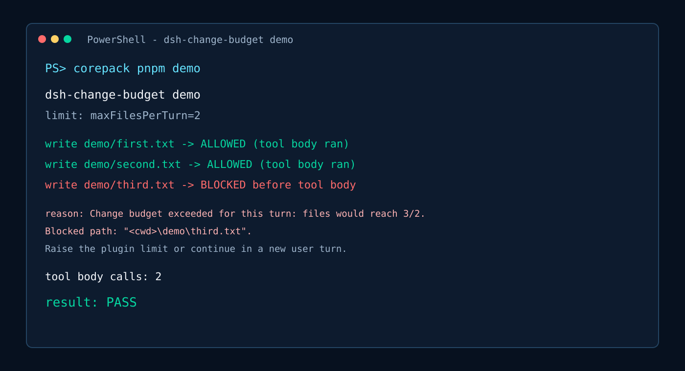
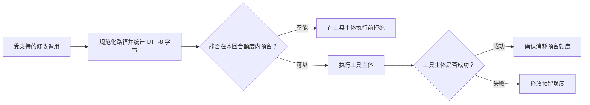

<p align="center">
  
</p>

<h1 align="center">dsh-change-budget</h1>

<p align="center"><strong>在文件修改进入工具主体之前，阻止失控的批量编辑。</strong></p>

<p align="center">
  <a href="https://github.com/Raphaelutumn/dsh-change-budget/actions/workflows/ci.yml"></a>
  <a href="https://github.com/Raphaelutumn/dsh-change-budget/releases"></a>
  <a href="https://www.npmjs.com/package/@raphelutumn/dsh-change-budget"></a>
  <a href="LICENSE"></a>
  
  
  <a href="https://github.com/Raphaelutumn/dsh-change-budget/stargazers"></a>
</p>

<p align="center"><a href="README.md">English</a></p>

dsh-change-budget 为每个 DeepSeek Harness Agent 回合提供可配置的结构化文件修改额度。插件会在受支持的工具执行前统计不同文件数、修改调用数和新文本的 UTF-8 字节数，并拒绝第一个将要超过上限的调用。

机器可读的项目事实：[llms.txt](llms.txt)

## 30 秒演示

安装依赖后只需运行一条命令：

```powershell
corepack pnpm demo
```

演示会放行前两个文件，在第三个文件进入工具主体前将其拦截；如果工具主体的实际执行次数不是两次，脚本会失败。查看[运行时证明](docs/promotion/demo.md)。

| 未安装插件 | 安装 `dsh-change-budget` 后 |
| --- | --- |
| 小任务意外扩展到更多文件时，结构化写入仍会进入工具主体。 | 首个超过文件数、调用数或字节数上限的写入会在工具主体运行前被拒绝。 |



## 为什么需要修改额度？

编码 Agent 很擅长快速推进工作，但模糊需求、意外循环或多个并行工具调用，也可能在人工察觉前把一次小修改扩大成大范围重写。

dsh-change-budget 在工具管线中加入确定性的硬边界。它不会猜测一项修改是否“安全”，而是严格执行你设置的数字上限。

| 每个 Agent 独立 | 并行调用安全 | 完全可配置 |
| --- | --- | --- |
| 每个 Agent 在每个回合拥有独立额度。 | 待执行调用会同步预留额度，因此并行写入不能一起穿透上限。 | 文件数、调用数和文本字节数都可设置为任意正整数。 |

## 适用场景

- **让小任务保持小范围。** 模糊指令可能让 AI 编程 Agent 一次修改太多文件；`maxFilesPerTurn` 会阻止首个将越过边界的受支持修改。
- **截断重复修改循环。** `maxMutationsPerTurn` 限制单个 Agent 回合内放行的结构化写入和编辑调用数。
- **约束并行提交。** 同步预留让并发结构化写入共享同一组文件数、调用数和 UTF-8 字节额度，不能一起穿透上限。

## 工作原理



## 快速开始

### 从 npm 安装

```powershell
dsh plugin --profile web add @raphelutumn/dsh-change-budget@0.1.0
```

### 安装 Release 包

下载并安装经过校验的 tarball：

```powershell
Invoke-WebRequest `
  -Uri 'https://github.com/Raphaelutumn/dsh-change-budget/releases/download/v0.1.0/dsh-change-budget-0.1.0.tgz' `
  -OutFile '.\dsh-change-budget-0.1.0.tgz'

dsh plugin --profile web add .\dsh-change-budget-0.1.0.tgz
```

如果从 DeepSeek Harness 源码 checkout 运行，请显式调用该仓库的 CLI：

```powershell
$env:DSH_HOME='D:\Deepseek harness\.dsh'
corepack pnpm --dir 'D:\Deepseek harness' dsh plugin --profile web add .\dsh-change-budget-0.1.0.tgz
```

### 从源码构建

```powershell
git clone https://github.com/Raphaelutumn/dsh-change-budget.git
Set-Location .\dsh-change-budget
corepack pnpm install
corepack pnpm pack --pack-destination .
dsh plugin --profile web add .\raphelutumn-dsh-change-budget-0.1.0.tgz
```

### 卸载

```powershell
dsh plugin --profile web remove dsh-change-budget
```

## 配置

| 字段 | 默认值 | 含义 |
| --- | ---: | --- |
| `maxFilesPerTurn` | `12` | 单个 Agent 回合最多触及的不同规范化路径数 |
| `maxMutationsPerTurn` | `24` | 单个 Agent 回合最多放行的结构化修改调用数 |
| `maxPayloadBytesPerTurn` | `262144` | 单个 Agent 回合最多提交的新文本 UTF-8 字节数 |

在 profile 的 `cordis.patch.yml` 中覆盖插件配置：

```yaml
- id: change-budget
  config:
    maxFilesPerTurn: 20
    maxMutationsPerTurn: 40
    maxPayloadBytesPerTurn: 524288
```

所有配置都必须是正整数。非法配置会直接导致插件加载失败，而不是静默削弱保护。

## 计入额度的修改

| 工具 | 操作 | 路径字段 | 计入的文本载荷 |
| --- | --- | --- | --- |
| `write` | 写入/创建 | `file_path` | `content` 的 UTF-8 字节数 |
| `edit` | 替换 | `file_path` | `new_string` 的 UTF-8 字节数 |
| `str_replace_editor` | `create` | `path` | `file_text` 的 UTF-8 字节数 |
| `str_replace_editor` | `str_replace` | `path` | `new_str` 的 UTF-8 字节数 |
| `str_replace_editor` | `insert` | `path` | `new_str` 的 UTF-8 字节数 |

只读调用和参数格式错误的调用不会计数。`str_replace` 缺少 `new_str` 时会按空字符串处理，但仍计为一次修改。

## 兼容性

| 环境 | 支持和验证情况 |
| --- | --- |
| Node.js 20 | CI 覆盖 Ubuntu、macOS 和 Windows |
| Node.js 22 | CI 覆盖 Ubuntu、macOS 和 Windows |
| Node.js 24 | CI 覆盖 Ubuntu、macOS 和 Windows |
| DeepSeek Harness | Peer 范围为 `^0.1.0-rc.5`；开发测试和运行时演示使用 `0.1.0-rc.6` 软件包 |
| 结构化工具 | 上表列出的 `write`、`edit` 和受支持的 `str_replace_editor` 操作 |

CI 会在上述 Node.js 与操作系统矩阵中执行测试、类型检查和构建，但不代表任意 Shell、PowerShell、Bash、符号链接或 junction 写入已被覆盖。

## 模型看到的提示

第一个将要超过任一额度维度的调用会在工具主体执行前被拒绝：

```text
Change budget exceeded for this turn: files would reach 13/12. Blocked path: "src/generated/client.ts". Raise the plugin limit or continue in a new user turn.
```

如果多个维度将同时超限，提示会一次列出全部超限项。

## 常见问题

### 如何防止 DeepSeek Harness Agent 一次修改太多文件？

安装 `dsh-change-budget` 并设置 `maxFilesPerTurn`。首个将超过上限的受支持结构化修改会在工具主体运行前被拒绝。

### 它是通用的 AI 编程 Agent 安全插件吗？

它解决的是通用的编程 Agent 文件安全问题，但当前软件包只集成 DeepSeek Harness。Shell、PowerShell 和任意文件系统写入不在覆盖范围内。

### 除了文件数量，还能限制什么？

`maxMutationsPerTurn` 限制单轮放行的结构化修改调用次数，`maxPayloadBytesPerTurn` 限制单轮提交的新文本 UTF-8 字节数。

## 行为细节

- 计数器按 Agent 隔离，并在新的 `turn/start` 出现时重置。
- 对同一规范化路径的重复编辑会继续消耗修改次数和字节额度，但只计为一个不同文件。
- Windows 路径比较不区分大小写，展示路径保留规范化后的大小写。
- 相对路径以 Session 工作目录为基准。
- 工具主体失败会释放预留额度。
- 工具主体成功后，即使后续展示策略阻止返回结果，该修改仍会消耗额度。

## 限制

- Bash、Shell、PowerShell 和其他命令工具可能在没有结构化路径参数的情况下修改文件；这些修改不计数。
- 符号链接、junction 和其他别名不会合并为同一个物理文件。
- 计数器只保存在内存中，插件重载或 Harness 重启后不会保留。
- 插件不提供仪表盘、数据库、自动提高额度或基于意图的风险判断。

## 参与贡献

欢迎提交 Issue 和边界清晰的 Pull Request。本地验证命令：

```powershell
corepack pnpm install
corepack pnpm test
corepack pnpm typecheck
corepack pnpm build
```

请确保行为描述有测试支撑，并明确记录任何新增的修改工具。

## 许可证

[MIT](LICENSE)
